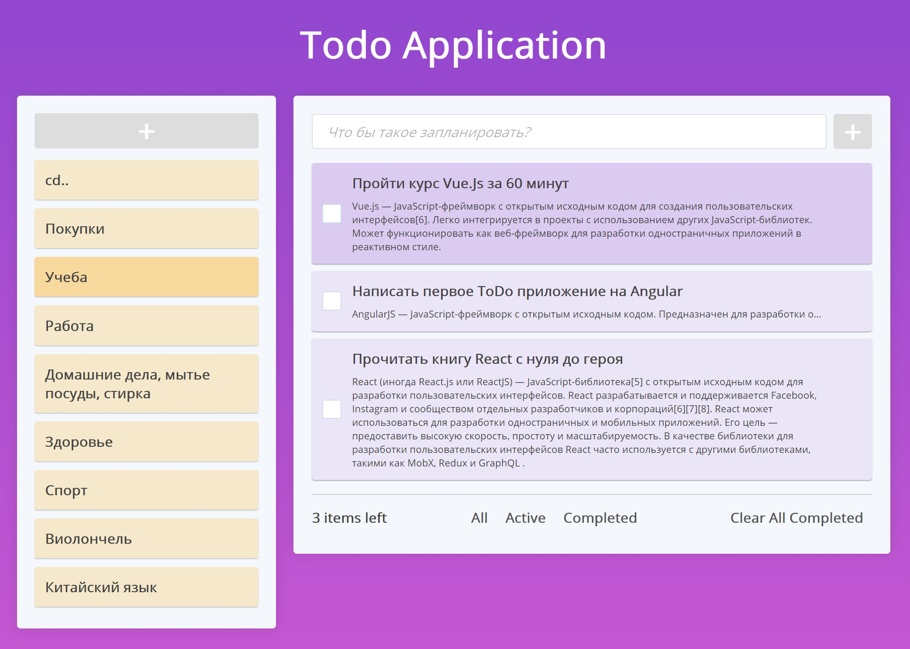
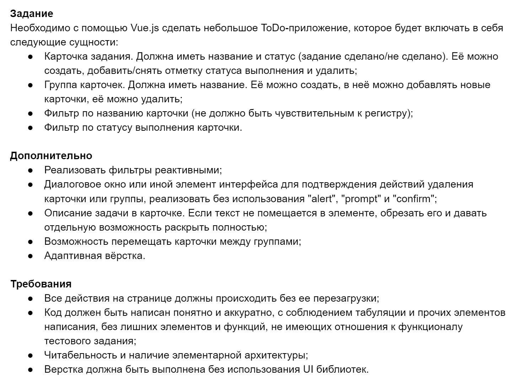

# todo-app

## Advanced To-Do List Application built with [#Vue.js](https://github.com/vuejs/vue)

This project is a advanced Todo SPA (Single Page App) inspired by [Procontext Co LTD](https://procontext.ru). Perfect to learn and demonstrate the basics about Vue.js with no any UI framework.

### Online **[DEMO](https://DmitriBelski.github.io/todo-app)**

## Основные функции:

- Выдели папку перед тем как создать новую задачу, и она появится в этой папке.
- Выдели одну или несколько задач в какой либо папке и нажми на другую папку, задачи переместятся по назначению.
- Удаляй папки вместе со всеми задачами внутри.
- Двойной щелчок по любому тексту в папках или задачах и можно редактировать.
- Одинарный щелчок по скрытому описанию, и оно откроется. Еще один щелчок, и скроется вновь.
- cd.. - это корневая папка, в ней тоже могут создаваться и храниться задачи.



## Instalation

### Clone repository
```
git clone https://github.com/DmitriBelski/todo-app.git
cd todo-app
```

### Install dependencies
```
npm install
```

### Compiles and hot-reloads for development
```
npm run serve
```

### Compiles and minifies for production
```
npm run build
```

### Lints and fixes files
```
npm run lint
```
## Task description


